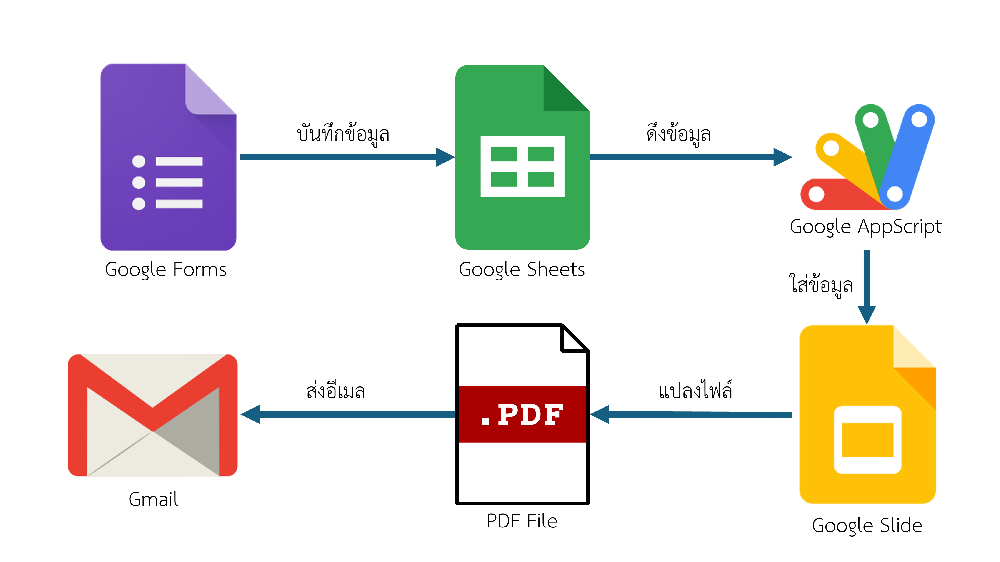

# คู่มือการทำงานของระบบรายงานการนิเทศฝึกงานผ่าน Google Apps Script

---

## **บทนำ**
ระบบรายงานการนิเทศฝึกงานถูกออกแบบมาเพื่อช่วยให้การจัดการข้อมูลการนิเทศฝึกงานเป็นระบบ โดยมีการบูรณาการระหว่าง Google Forms, Google Sheets, Google Slides และ Google Apps Script เพื่อสร้างไฟล์ PDF และส่งกลับไปยังผู้ใช้งานผ่านอีเมลหรือ LINE Notify โดยทำงานอย่างอัตโนมัติหลังจากที่มีการกรอกข้อมูลใน Google Form

---

## **โครงสร้างการทำงานของระบบ**



1. **Google Forms**:  
   - ใช้สำหรับให้ผู้ใช้งานกรอกข้อมูล เช่น อีเมล, ชื่อสถานประกอบการ, และข้อมูลการนิเทศอื่น ๆ
   - เมื่อกด Submit ข้อมูลจะถูกบันทึกลงใน Google Sheets

2. **Google Sheets**:  
   - เก็บข้อมูลที่ส่งมาจาก Google Forms โดยแต่ละคอลัมน์จะถูกแมปด้วยตัวแปร `index_col`
   - ใช้ในการตรวจสอบและจัดการสถานะการส่งข้อมูล เช่น `send_email_status` หรือ `create_pdf_status`

3. **Google Slides**:  
   - ใช้เป็นแม่แบบ (Template) สำหรับการสร้างรายงาน
   - Placeholder เช่น `{{ชื่อสถานประกอบการ}}` หรือ `{{วันที่ทำการออกนิเทศก์}}` จะถูกแทนที่ด้วยข้อมูลจาก Google Sheets

4. **Google Apps Script**:  
   - สคริปต์หลักที่ทำหน้าที่:
     - ดึงข้อมูลจาก Google Sheets
     - แทนค่าข้อมูลใน Google Slides
     - สร้างไฟล์ PDF
     - ส่งไฟล์ PDF ผ่านอีเมลและ LINE Notify
   - การทำงานทั้งหมดถูกควบคุมด้วยฟังก์ชันและตัวแปรในโค้ด

---

## **การตั้งค่าตัวแปรในโค้ด**

### **1. ตัวแปรทั่วไปสำหรับการตั้งค่า**
```javascript
let templateSlideId = '1wt42EkRnzplmjSV71E-R0FHVkWN69xJ2Xml5w0IzKuk'; 
let folderResponsePdfId = '1CjbQ9CpNdcPRWGGu5pFkQlN2fpCJDtrm'; 
let folderResponseSlideId = '1TB0iSwhlarG93besbpb9c7pxH3PtgIYR'; 
let sheetName = 'การตอบแบบฟอร์ม 1'; 
let pdf_file_name = "รายงานการประเมินการนิเทศฝึกงาน"; 
let isSendEmail = true; 
let isSendLine = false; 
let email_send_default = ['dvt2563ktcm@gmail.com']; 
var email_subject = 'ขอบคุณสำหรับการประเมินการนิเทศฝึกงาน'; 
var email_message = 'แบบฟอร์มการประเมินการนิเทศฝึกงานได้จัดส่งให้ท่านแล้ว'; 
```
- `templateSlideId`: รหัส (ID) ของ Google Slides Template ที่ใช้เป็นแม่แบบ
- `folderResponsePdfId`: รหัส (ID) ของโฟลเดอร์ที่ใช้เก็บไฟล์ PDF
- `folderResponseSlideId`: รหัส (ID) ของโฟลเดอร์ที่ใช้เก็บ Google Slides ที่สร้างใหม่
- `sheetName`: ชื่อ Google Sheet ที่เก็บข้อมูลจาก Google Form
- `pdf_file_name`: ชื่อไฟล์ PDF ที่จะถูกสร้างขึ้น
- `isSendEmail`: กำหนดว่าระบบจะส่งอีเมลหรือไม่ (ค่า `true` หมายถึงส่ง, `false` หมายถึงไม่ส่ง)
- `isSendLine`: กำหนดว่าระบบจะส่ง LINE Notify หรือไม่ (ค่า `true` หมายถึงส่ง, `false` หมายถึงไม่ส่ง)
- `email_send_default`: อีเมลเริ่มต้นสำหรับส่ง PDF หากไม่ได้ระบุในแบบฟอร์ม
- `email_subject`: หัวข้ออีเมลที่ตอบกลับผู้ใช้งาน
- `email_message`: เนื้อหาอีเมลที่ตอบกลับผู้ใช้งาน

### **2. ตัวแปรสำหรับอีเมล**
```javascript
let colEmail = index_col["อีเมล"];
let colEmailStatus = index_col["send_email_status"] || "";
let colEmailStatusName = "AC";
```
- `colEmail`: คอลัมน์ใน Google Sheets ที่เก็บอีเมล
- `colEmailStatus`: คอลัมน์ที่เก็บสถานะการส่งอีเมล (`SENT` หากส่งสำเร็จ)
- `colEmailStatusName`: ชื่อคอลัมน์ใน Google Sheets (ค่าคงที่: `AC`)

### **3. ตัวแปรสำหรับ LINE Notify**
```javascript
let colLineStatus = index_col["send_line_status"] || "";
let colLineStatusName = "O";
let tokensV2 = [''];  
```
- `colLineStatus`: คอลัมน์ที่เก็บสถานะการส่งข้อความ LINE Notify
- `colLineStatusName`: ชื่อคอลัมน์ใน Google Sheets (ค่าคงที่: `O`)
- `tokensV2`: เก็บ LINE Token สำหรับส่งข้อความผ่าน LINE Notify

### **4. ตัวแปรสำหรับไฟล์ PDF**
```javascript
let colName = index_col["ชื่อสถานประกอบการ"] + "_" + index_col["ครูนิเทศ"] || "";
let colPdfStatus = index_col["create_pdf_status"] || "";
let colPdfStatusName = "AB";
```
- `colName`: ใช้ข้อมูลจากคอลัมน์ `ชื่อสถานประกอบการ` และ `ครูนิเทศ` เพื่อสร้างชื่อไฟล์ PDF
- `colPdfStatus`: คอลัมน์ที่เก็บสถานะการสร้าง PDF
- `colPdfStatusName`: ชื่อคอลัมน์ใน Google Sheets (ค่าคงที่: `AB`)

### **5. ตัวแปรสำหรับรูปภาพ**
```javascript
let colAllImage = [
  { [index_col['รูปภาพการนิเทศ1']]: '{{รูปภาพการนิเทศ1}}' },
  { [index_col['รูปภาพการนิเทศ2']]: '{{รูปภาพการนิเทศ2}}' },
];
```
- `colAllImage`: กำหนดคอลัมน์รูปภาพใน Google Sheets และ Placeholder ใน Google Slides เช่น `รูปภาพการนิเทศ1` จะแทนที่ `{{รูปภาพการนิเทศ1}}`

### **6. ตัวแปรสำหรับ Checkbox**
```javascript
let index_col_checkbox = [];
let index_col_multi_checkbox = [];
```
- `index_col_checkbox`: ใช้ระบุข้อมูลที่ต้องแสดงเป็น Checkbox (กรณีมี)
- `index_col_multi_checkbox`: ใช้ระบุข้อมูล Checkbox หลายค่าในคอลัมน์เดียว (กรณีมี)

---

## **ฟังก์ชันสำคัญในโค้ด**

### **1. `formToSlidePdfLine`**
- ฟังก์ชันหลักที่ควบคุมการทำงาน
  - ดึงข้อมูลจาก Google Sheets
  - สร้าง Google Slides
  - สร้างไฟล์ PDF และส่งอีเมลหรือ LINE Notify

### **2. `generateTitle`**
- ใช้ดึงชื่อคอลัมน์ใน Google Sheets และสร้างตัวแปร `index_col` อัตโนมัติ

### **3. `duplicateSlide`**
- คัดลอก Google Slides Template เพื่อใช้เป็นไฟล์ต้นแบบ

### **4. `updateSlideData`**
- นำข้อมูลจาก Google Sheets ไปแทนที่ Placeholder ใน Google Slides

### **5. `createPdf`**
- สร้างไฟล์ PDF จาก Google Slides และบันทึกในโฟลเดอร์ที่กำหนด

### **6. `sendEmailWithAttachment`**
- ส่งไฟล์ PDF ไปยังอีเมลที่ระบุ

### **7. `sendLineNotify`**
- ส่งข้อความ LINE Notify พร้อมลิงก์ PDF

### **8. `updateStatusSent`**
- อัปเดตสถานะ (`SENT`) ใน Google Sheets หลังจากการส่งอีเมลหรือ PDF สำเร็จ

---

## **ขั้นตอนการตั้งค่า**

1. **สร้าง Google Form และเชื่อมโยงกับ Google Sheets**  
   - ออกแบบฟอร์มให้สอดคล้องกับข้อมูลที่ต้องการ เช่น อีเมล, ชื่อสถานประกอบการ ฯลฯ
   - ตั้งชื่อคอลัมน์ใน Google Sheets ให้ตรงกับข้อมูลใน Google Form

2. **สร้าง Google Slides Template**  
   - ใช้ `{{ชื่อข้อมูล}}` เป็น Placeholder ในแม่แบบ เช่น `{{ชื่อสถานประกอบการ}}`

3. **ตั้งค่าตัวแปรใน Apps Script**  
   - กำหนดค่า `templateSlideId`, `folderResponsePdfId`, และ `folderResponseSlideId`
   - เพิ่มคอลัมน์ที่เกี่ยวข้อง เช่น `send_email_status` และ `create_pdf_status`

4. **ทดสอบระบบ**  
   - กรอกข้อมูลใน Google Form
   - ตรวจสอบการสร้าง PDF และการส่งอีเมลหรือ LINE Notify

---

## **การแก้ไขข้อมูล**

1. หากแก้ไขฟอร์ม:
   - เรียกใช้ฟังก์ชัน `generateTitle` เพื่อสร้างตัวแปร `index_col` ใหม่
   - คัดลอกค่าที่ได้ไปแทนในโค้ด

2. หากแก้ไข Template:
   - เพิ่มหรือปรับ Placeholder ใน Google Slides ให้ตรงกับคอลัมน์ใน Google Sheets

---

## **สรุป**
ระบบนี้ออกแบบมาเพื่อจัดการข้อมูลการนิเทศฝึกงานอย่างเป็นระบบและอัตโนมัติ โดยผู้ใช้งานสามารถปรับแต่งตัวแปรและฟังก์ชันใน Apps Script เพื่อให้สอดคล้องกับความต้องการเฉพาะขององค์กร ทั้งนี้ การตั้งค่าที่ถูกต้องและการทดสอบระบบจะช่วยให้ระบบทำงานได้อย่างราบรื่น.
